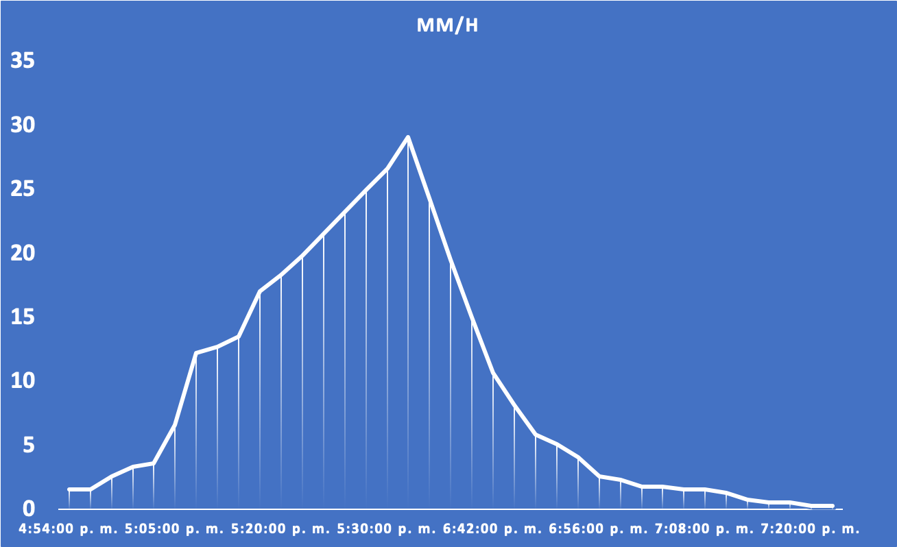
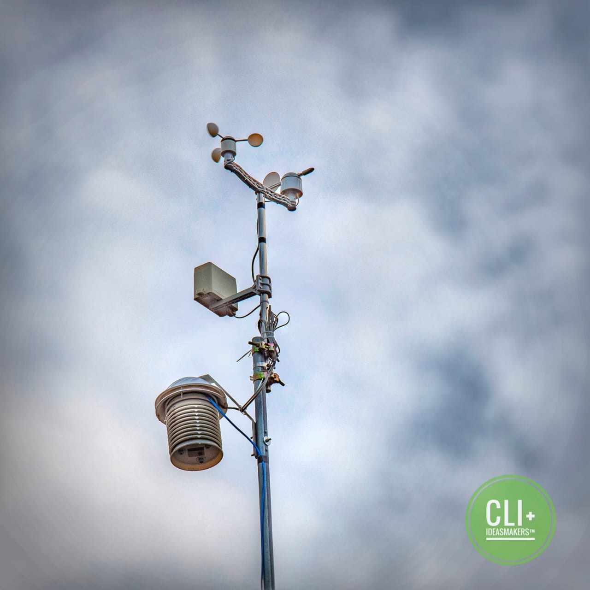
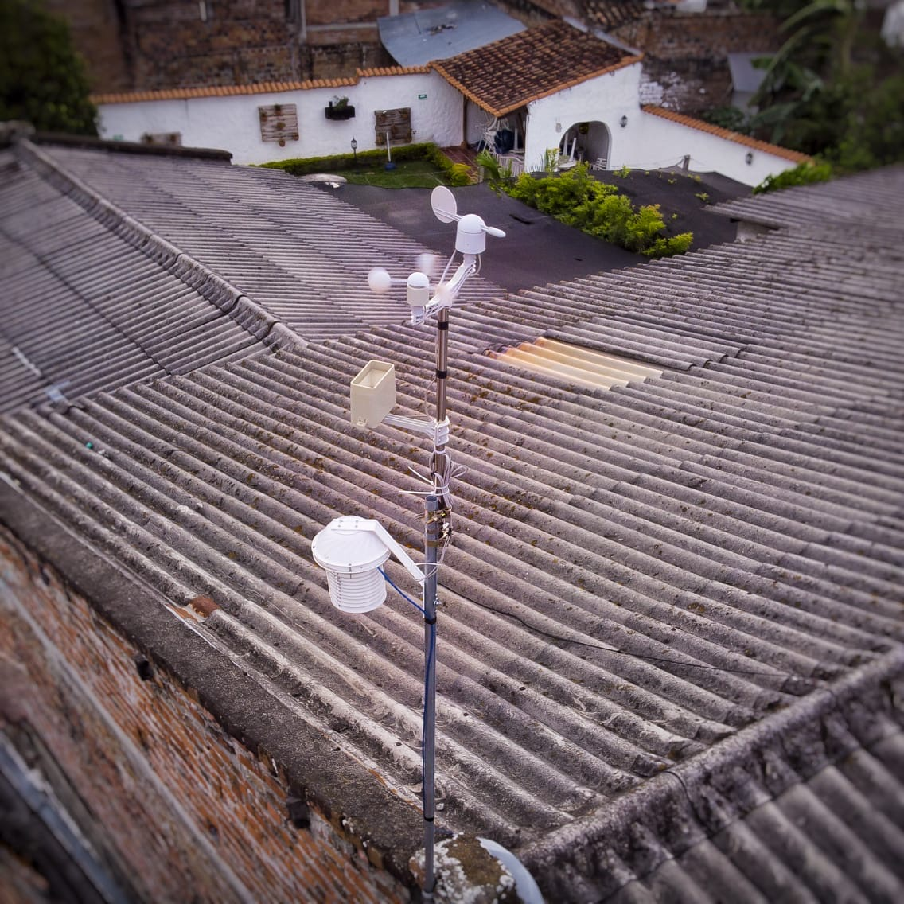

## Cálculo de pluviosidad en Roldanillo el 26/05/2020

El día 26 de mayo de 2020 hubo una lluvia considerablemente fuerte en Roldanillo y en la zona aledaña del Valle.

Mi amigo Josías, me recordó que en nuestra App: [Maclic](https://l.maclic.co/get). Contamos con instrumentos de medición meteorológicas, entre los cuales se incluye un pluviómetro.

Si bien actualmente la versión móvil de la app no incluye toda la información que captamos (lo hará próximamente), si almacenamos estos datos y por eso en compañía de nuestro compañero Ivan, quien diseño los instrumentos de medición, nos dimos a la tarea de procesar estos datos para calcular la cantidad de agua que llovió sobre nuestro municipio.

### Un inconveniente no menor

Al revisar la información recolectada, lo primero que notamos (Ivan lo había notado antes directamente en la app), es que teníamos un segmento de tiempo (de aproximadamente 1 hora) en el que no recibimos datos.

Cómo se puede apreciar en la imagen, no tenemos datos registrados justo en el pico de la gráfica, probablemente debido a que la lluvia fuerte interfirió con la unidad GSM del dispositivo medidor, razón por la cual los datos no se enviaron.

**Nota:** *El problema es que de momento la unidad no almacena localmente estos datos para enviarlos una vez restablezca comunicación con el servidor. Trabajaremos en incluir estas mejoras pronto.*

### Hicimos nuestros cálculos

Sin embargo contamos con una cantidad considerable de datos, así que nos pusimos manos a la obra. Procesamos la información al obtener los datos del instrumento de medición haciendo uso de un *end point REST* de nuestros servidores de [Maclic](https://maclic.co) (lo siento ese end point es privado por el momento), y luego procesé los datos creando un sencillo programa en [NodeJS](https://nodejs.org/es/), el cual pueden usar clonando de este repositorio.

Calculamos el promedio de lluvia mm/h (milímetros hora) desde el momento en el que empezó la lluvia, hasta que terminó. También en función de ese tiempo la cantidad aproximada de milímetros (y litros por metro cuadrado) que llovieron.

#### ¿Y los datos faltantes?

Decidimos hacer unas aproximaciones tomando en cuenta la curva ascendente y rellenando los puntos con una linea ascendente/descendente entre los extremos del periodo faltante para obtener una aproximación más cercana a la realidad (en el código fuente también se incluye una función para generar estos datos faltantes).

## Los Resultados

Nuestra conclusión más cercana a la realidad es que en Roldanillo, entre las 4:54pm y las 7:20pm del 26 de mayo de 2020, es decir durante 146 minutos de lluvia, en promedio 14.43 mm/h (milímetros por hora), lo cual significa que llovieron aproximadamente: 35.12mm o lo que es lo mismo 35.12 litros por metro cuadrado.

### Todos los cálculos

##### Usando todos los datos sin incluir datos ingresados "manualmente".

*Minutos lluvia:* **146** 
*Promedio:* **5.88 mm/h** 
*Milímetros:* **14.30** 
*Litros por metro cuadrado:* **14.30**

##### Usando los datos del rango más alto de medidas (a partir de 10 mm/h) y sin incluir los datos ingresandos "manuales".

*Minutos lluvia:* **92** 
*Promedio:* **14.89 mm/h** 
*Milímetros:* **22.83** 
*Litros por metro cuadrado:* **22.83**

##### Usando todos los datos incluyendo los datos ingresados "manualmente".

*Minutos lluvia:* **146** 
*Promedio:* **14.43 mm/h** 
*Milímetros:* **35.12** 
*Litros por metro cuadrado:* **35.12**

##### Usando los datos del rango más alto de medidas (a partir de 10 mm/h) e incluyendo los datos ingresados manualmente.

*Minutos lluvia:* **92** 
*Promedio:* **23.42 mm/h** 
*Milímetros:* **35.90** 
*Litros por metro cuadrado:* **35.90**

## Notas adicionales

Si alguien quiere ayudarnos a mejorar nuestros cálculos, bienvenido. Puede hacer un *pull request* cuando quiera. Esta fue la mejor aproximación que pudimos realizar, sin embargo estamos abiertos a que nos ayuden a mejorar nuestra metodología.

### Los datos que actualmente mostramos en Maclic

No olviden que pueden descargar Maclic siguiendo este enlace: [https://l.maclic.co/get](https://l.maclic.co/get). O pueden acceder a la versión Web: [https://web.maclic.co](https://web.maclic.co).

### Fotos de los instrumentos de la estación

El diseño e implementación de la estación meteorológica **CLI+** para Maclic fue desarrollado por **IdeasMakers** ([Rt Ivancho](https://www.facebook.com/RT.Ivancho)).

